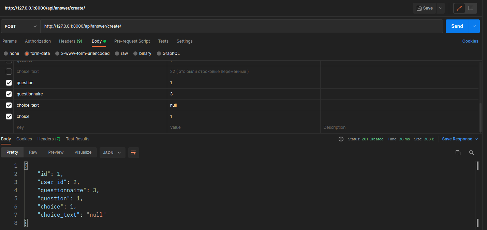

# Инструкция по разворачиванию приложения

#### Окружение проекта:
  * python 3.8
  * Django 2.2.10
  * djangorestframework

#### Склонируйте репозиторий с помощью git:
```sh
git clone https://github.com/PontificSalivan/ApiForQuestionnaire
```

#### Перейдите в директорию проекта:
```sh
cd ./ApiForQuestionnaire
```
#### Запустите команду docker:
```sh
docker-compose build
```
или
```sh
sudo docker-compose build
```
#### Создайте миграции приложения для базы данных:
```sh
docker-compose run web python manage.py migrate
```
или
```sh
sudo docker-compose run web python manage.py migrate
```
#### Создайте суперпользователя:
```sh
docker-compose run web python manage.py createsuperuser
```
или
```sh
sudo docker-compose run web python manage.py createsuperuser
```
#### Заполните поля регистрации ( почта необязательна ):
```sh
Username (leave blank to use ...): 
Email address: 
Password: 
Password (again): 
Superuser created successfully. 
```

#### Запустите приложение (localhost: http://0.0.0.0:8000/):
```sh
docker-compose up
```
или
```sh
sudo docker-compose up
```

# Документация API

* #### Символ % означает, что нужно вместо него вставить данные
### Чтобы получить токен пользователя: 
* Request method: POST
* URL: http://localhost:8000/api/login/
* Body: 
    * username: %
    * password: %
* Консольная команда:
```
curl --location --request POST 'http://localhost:8000/api/login/' \
--form 'username=%' \
--form 'password=%'
```
#### Пример запроса в Postman (form-data)

#### Последующие запросы идут с данным выше токеном в Headers как показано ниже:


### Чтобы создать опрос:
* Request method: POST
* URL: http://localhost:8000/api/questionnaire/create/
* Headers:
   *  Authorization: Token %
* Body:
    * questionnaire_name: имя опроса
    * pub_date: дата публикации опроса, формат: YYYY-MM-DD HH:MM:SS
    * end_date: дата конца опроса, формат: YYYY-MM-DD HH:MM:SS
    * questionnaire_description: описание опроса
* Консольная команда: 
```
curl --location --request POST 'http://localhost:8000/api/questionnaire/create/' \
--header 'Authorization: Token %' \
--form 'questionnaire_name=%' \
--form 'pub_date=%' \
--form 'end_date=%' \
--form 'questionnaire_description=%'
```
#### Пример запроса в Postman (form-data)


### Обновить опрос:
* Request method: PATCH
* URL: http://localhost:8000/api/questionnaire/update/[questionnaire_id]/
* Headers:
    * Authorization: Token %
* Params:
    * questionnaire_id 
* Body:
    * questionnaire_name: имя опроса
    * end_date: дата конца опроса, формат: YYYY-MM-DD HH:MM:SS
    * questionnaire_description: описание опроса
* Консольная команда:
```
curl --location --request PATCH 'http://localhost:8000/api/questionnaire/update/[questionnaire_id]/' \
--header 'Authorization: Token %' \
--form 'questionnaire_name=%' \
--form 'end_date=%' \
--form 'questionnaire_description=%'
```
#### Пример запроса в Postman (form-data)


### Удалить опрос:
* Request method: DELETE
* URL: http://localhost:8000/api/questionnaire/update/[questionnaire_id]
* Headers:
    * Authorization: Token %
* Params:
    * questionnaire_id
Консольная команда:
```
curl --location --request DELETE 'http://localhost:8000/api/questionnaire/update/[questionnaire_id]/' \
--header 'Authorization: Token %'
```
#### Пример запроса в Postman (form-data)


### Просмотр всех опросов:
* Request method: GET
* URL: http://localhost:8000/api/questionnaire/view/
* Headers:
    * Authorization: Token %
* Консольная команда:
```
curl --location --request GET 'http://localhost:8000/api/questionnaire/view/' \
--header 'Authorization: Token %'
```
#### Пример запроса в Postman (form-data)


### Просмотр текущих активных опросов:
* Request method: GET
* URL: http://localhost:8000/api/questionnaire/view/active/
* Headers:
    * Authorization: Token %
* Консольная команда:
```
curl --location --request GET 'http://localhost:8000/api/questionnaire/view/active/' \
--header 'Authorization: Token %'
```
#### Пример запроса в Postman (form-data)


### Создаем вопрос:
* Request method: POST
* URL: http://localhost:8000/api/question/create/
* Headers:
    * Authorization: Token %
* Body:
    * questionnaire: id опроса 
    * question_text: текст вопроса 
    * question_type: может быть только `one` - вопрос с одиночным ответом, `multiple` - вопрос с множеством ответов или `text` - вопрос с текстовым ответом
* Консольная команда:
```
curl --location --request POST 'http://localhost:8000/api/question/create/' \
--header 'Authorization: Token %' \
--form 'questionnaire=%' \
--form 'question_text=%' \  
--form 'question_type=%' \
```
#### Пример запроса в Postman (form-data)


### Обновляем вопрос:
* Request method: PATCH
* URL: http://localhost:8000/api/question/update/[question_id]/
* Headers:
    * Authorization: Token %
* Params:
    * question_id
* Body:
    * questionnaire: id опроса
    * question_text: текст вопроса
    * question_type: может быть только `one` - вопрос с одиночным ответом, `multiple` - вопрос с множеством ответов или `text` - вопрос с текстовым ответом
* Консольная команда:
```
curl --location --request PATCH 'http://localhost:8000/api/question/update/[question_id]/' \
--header 'Authorization: Token %' \
--form 'questionnaire=%' \
--form 'question_text=%' \
--form 'question_type=%' \
```
#### Пример запроса в Postman (form-data)


### Удаляем вопрос:
* Request method: DELETE
* URL: http://localhost:8000/api/question/update/[question_id]/
* Headers:
    * Authorization: Token %
* Params:
    * question_id
* Консольная команда:
```
curl --location --request DELETE 'http://localhost:8000/api/question/update/[question_id]/' \
--header 'Authorization: Token %' \
--form 'questionnaire=%' \
--form 'question_text=%' \
--form 'question_type=%' \
```
#### Пример запроса в Postman (form-data)


### Создаем выбор:
* Request method: POST
* URL: http://localhost:8000/api/choice/create/
* Headers:
    * Authorization: Token %
* Body:
    * question: id вопроса
    * choice_text: текст выбора
* Консольная команда:
```
curl --location --request POST 'http://localhost:8000/api/choice/create/' \
--header 'Authorization: Token %' \
--form 'question=%' \
--form 'choice_text=%'
```
#### Пример запроса в Postman (form-data)


### Обновляем выбор:
* Request method: PATCH
* URL: http://localhost:8000/api/choice/update/[choice_id]/
* Headers:
    * Authorization: Token %
* Params:
    * choice_id
* Body:
    * question: id вопроса
    * choice_text: текст выбора
* Консольная команда:
```
curl --location --request PATCH 'http://localhost:8000/api/choice/update/[choice_id]/' \
--header 'Authorization: Token %' \
--form 'question=%' \
--form 'choice_text=%'
```
#### Пример запроса в Postman (form-data)


### Обновляем выбор:
* Request method: DELETE
* URL: http://localhost:8000/api/choice/update/[choice_id]/
* Headers:
    * Authorization: Token %
* Params:
    * choice_id
* Консольная команда:
```
curl --location --request DELETE 'http://localhost:8000/api/choice/update/[choice_id]/' \
--header 'Authorization: Token %' \
--form 'question=%' \
--form 'choice_text=%'
```
#### Пример запроса в Postman (form-data)


### Создаем ответ:
* Request method: POST
* URL: http://localhost:8000/api/answer/create/
* Headers:
    * Authorization: Token %
* Body:
    * questionnaire: id опроса
    * question: id вопроса
    * choice: если тип вопроса `one` или `multiple`, то в данное поле нужен id выбора, иначе вставьте null
    * choice_text: если тип вопроса `text`, то в данное поле нужен текстовый ответ, иначе вставьте null
* Консольная команда:
```
curl --location --request POST 'http://localhost:8000/api/answer/create/' \
--header 'Authorization: Token %' \
--form 'questionnaire=%' \
--form 'question=%' \
--form 'choice=%' \
--form 'choice_text=%'
```
#### Пример запроса в Postman (form-data)


### Обновляем ответ:
* Request method: PATCH
* URL: http://localhost:8000/api/answer/update/[answer_id]/
* Headers:
    * Authorization: Token %
* Params:
    * answer_id
* Body:
    * questionnaire: id опроса
    * question: id вопроса
    * user_id: id текущего пользователя (если забылся, в предыдущем запросе создания ответа он выводился)
    * choice: если тип вопроса `one` или `multiple`, то в данное поле нужен id выбора, иначе вставьте null
    * choice_text: если тип вопроса `text`, то в данное поле нужен текстовый ответ, иначе вставьте null
* Консольная команда:
```
curl --location --request PATCH 'http://localhost:8000/api/answer/update/[answer_id]' \
--header 'Authorization: Token %' \
--form 'questionnaire=%' \
--form 'question=%' \
--form 'choice=%' \
--form 'choice_text=%'
```
#### Пример запроса в Postman (form-data)


### Удаляем ответ:
* Request method: DELETE
* URL: http://localhost:8000/api/answer/update/[answer_id]/
* Headers:
    * Authorization: Token %
* Params:
    * answer_id
* Консольная команда:
```
curl --location --request DELETE 'http://localhost:8000/api/answer/update/[answer_id]' \
--header 'Authorization: Token %'
```
#### Пример запроса в Postman (form-data)


### Просматриваем ответы пользователя:
* Request method: GET
* URL: http://localhost:8000/api/answer/view/[user_id]/
* Params:
    * user_id
* Headers:
    * Authorization: Token %
* Консольная команда:
```
curl --location --request GET 'http://localhost:8000/api/answer/view/[user_id]' \
--header 'Authorization: Token %'
```

#### Пример запроса в Postman (form-data)

